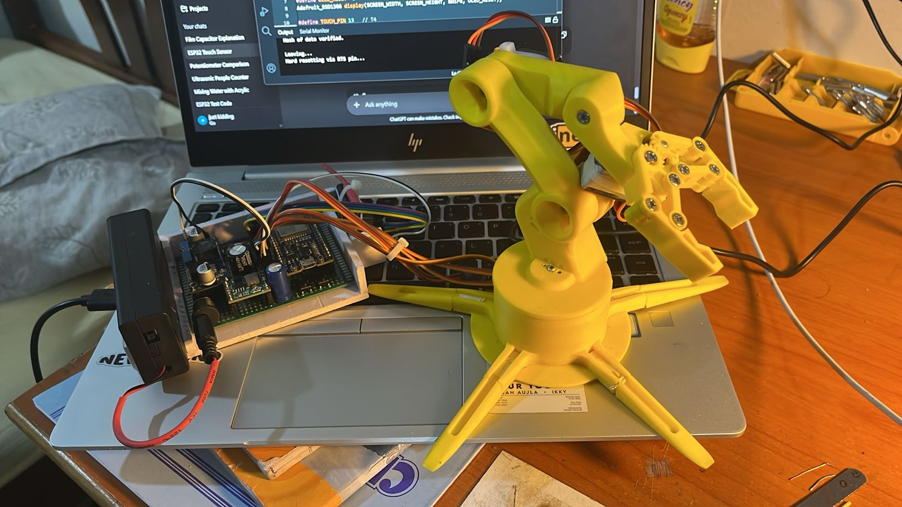
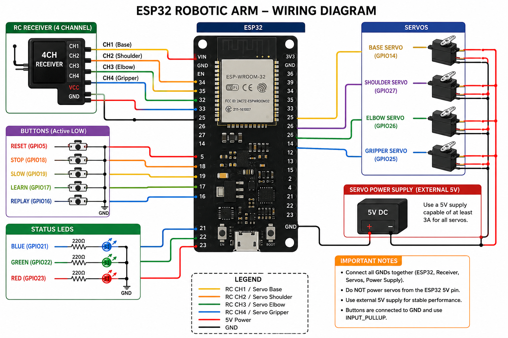

# 🤖 ESP32 Robotic Arm

An ESP32-based 4-DOF robotic arm controlled using an RC transmitter and receiver. The project demonstrates wireless control, servo motor manipulation, and robotic arm movement for pick-and-place applications.

---

## 📸 Project Images

| Robotic Arm    | Wiring Diagram  |
| -------------- | --------------- |
|  |  |

---

## ✨ Features

* 🎮 Wireless RC control
* 🤖 4 Degrees of Freedom (4-DOF)
* ⚡ Smooth servo movements
* 🔴 LED status indicators
* 🔘 Push-button controls
* 📦 Pick-and-place functionality
* 🔧 Easy to modify and expand

---

## 🛠 Components Used

| Component                 | Quantity    |
| ------------------------- | ----------- |
| ESP32 Development Board   | 1           |
| Servo Motors              | 4           |
| FlySky Receiver           | 1           |
| Push Buttons              | 5           |
| LEDs                      | 3           |
| Robotic Arm Chassis       | 1           |
| 5V Power Supply           | 1           |
| Connecting Wires          | As required |
| Breadboard/PCB (Optional) | 1           |

---

## 🔌 Wiring

The complete wiring diagram is shown below:


---

## 📂 Repository Structure

```text
Robotic-arm/
│
├── code.ino
├── README.md
├── wiring.png
├── pic1.jpeg
├── pic2.jpeg
├── pic3.jpeg
└── 3dparts/
```

---

## 🚀 Getting Started

### 1. Clone Repository

```bash
git clone https://github.com/yo5on/Robotic-arm.git
```

### 2. Open in Arduino IDE

Open:

```text
code.ino
```

### 3. Install Required Libraries

* ESP32 Board Package
* ESP32Servo Library

### 4. Upload the Code

1. Connect the ESP32 to your computer.
2. Select the correct ESP32 board and COM port.
3. Open `code.ino`.
4. Click **Upload**.

---

## 🎮 Controls

| Channel | Function          |
| ------- | ----------------- |
| CH1     | Base Rotation     |
| CH2     | Shoulder Movement |
| CH3     | Elbow Movement    |
| CH4     | Gripper Control   |

---

## 🧠 Working Principle

1. The FlySky transmitter sends control signals to the receiver.
2. The ESP32 reads the receiver channels.
3. Based on the input, the ESP32 controls the four servo motors.
4. LEDs indicate the system status and operating mode.
5. Push buttons can be used for mode selection, resetting, or calibration.

---

## 🔮 Future Improvements

* 🧠 Inverse Kinematics
* 📱 Mobile App Control
* 📷 Camera Integration
* 🤖 AI-Based Object Detection
* 🎯 Preset Position Memory
* 🌐 Wi-Fi and Bluetooth Control

---

## 👨‍💻 Author

**Yo5on**
Robotics and Embedded Systems Enthusiast

* 🔧 Interested in Robotics and Embedded Systems
* 🤖 Building ESP32-based robotic projects
* 🚀 Exploring automation and intelligent control systems

---

⭐ **If you like this project, please give it a star and share your feedback!**
