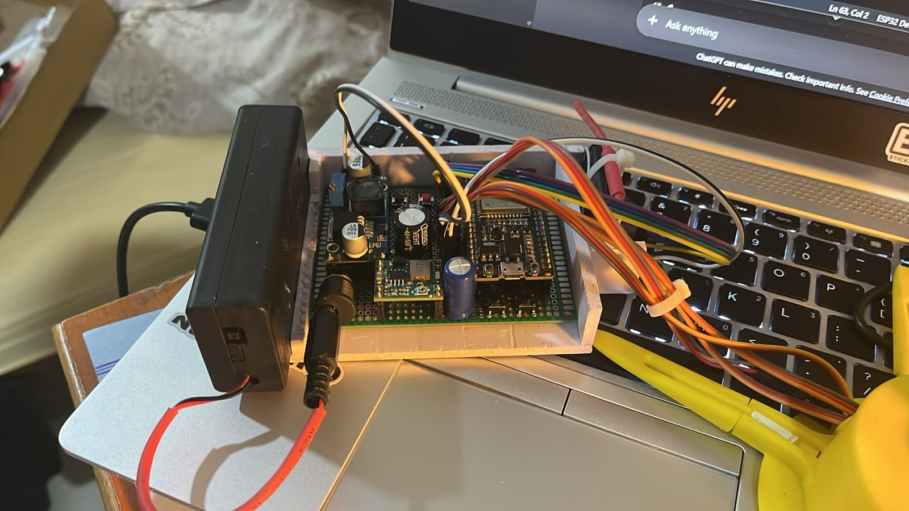

# 🤖 ESP32 Robotic Arm

An ESP32-based 4-DOF robotic arm controlled using an RC transmitter and receiver. The project demonstrates wireless control, servo motor manipulation, and robotic arm movement for pick-and-place applications.

---

## 📸 Project Images

| Robotic Arm | Wiring Diagram |
|-------------|----------------|
|  |  |

---

## ✨ Features

- Wireless RC control
- 4 Degrees of Freedom (4-DOF)
- Smooth servo movements
- Pick-and-place functionality
- Easy to modify and expand

---

## 🛠 Components Used

| Component | Quantity |
|------------|-----------|
| ESP32 Development Board | 1 |
| Servo Motors | 4 |
| FlySky Receiver | 1 |
| Robotic Arm Chassis | 1 |
| 5V Power Supply | 1 |
| Connecting Wires | As required |

---

## 🔌 Wiring

The complete wiring diagram is shown below:


---

## 📂 Repository Structure

```
Robotic-arm/
│
├── code.ino
├── README.md
├── wiring.png
├── pic1.jpeg
├── pic2.jpeg
├── pic3.jpeg
└── 3dparts/
```

---

## 🚀 Getting Started

### 1. Clone Repository

```bash
git clone https://github.com/yo5on/Robotic-arm.git
```

### 2. Open in Arduino IDE

Open:

```
code.ino
```

### 3. Install Libraries

- ESP32 Board Package
- ESP32Servo Library

### 4. Upload Code

1. Connect ESP32.
2. Select correct COM port.
3. Click Upload.

---

## 🎮 Controls

| Channel | Function |
|----------|-----------|
| CH1 | Base Rotation |
| CH2 | Shoulder |
| CH3 | Elbow |
| CH4 | Gripper |

---

## 🔮 Future Improvements

- Inverse Kinematics
- Mobile App Control
- Camera Integration
- Object Detection using AI

---

## 👨‍💻 Author

**Yo5on**

Robotics and Embedded Systems Enthusiast

⭐ If you like this project, consider giving it a star!
