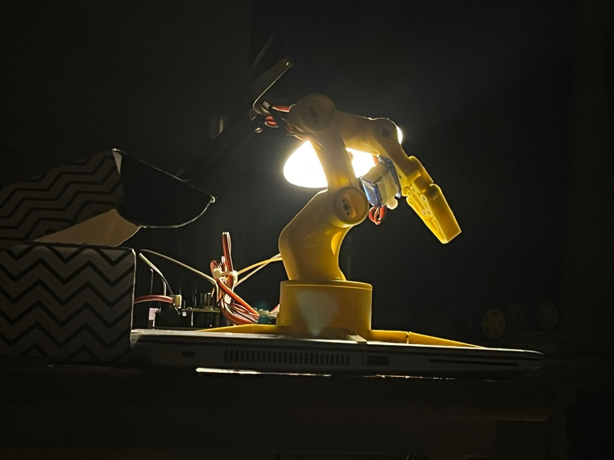
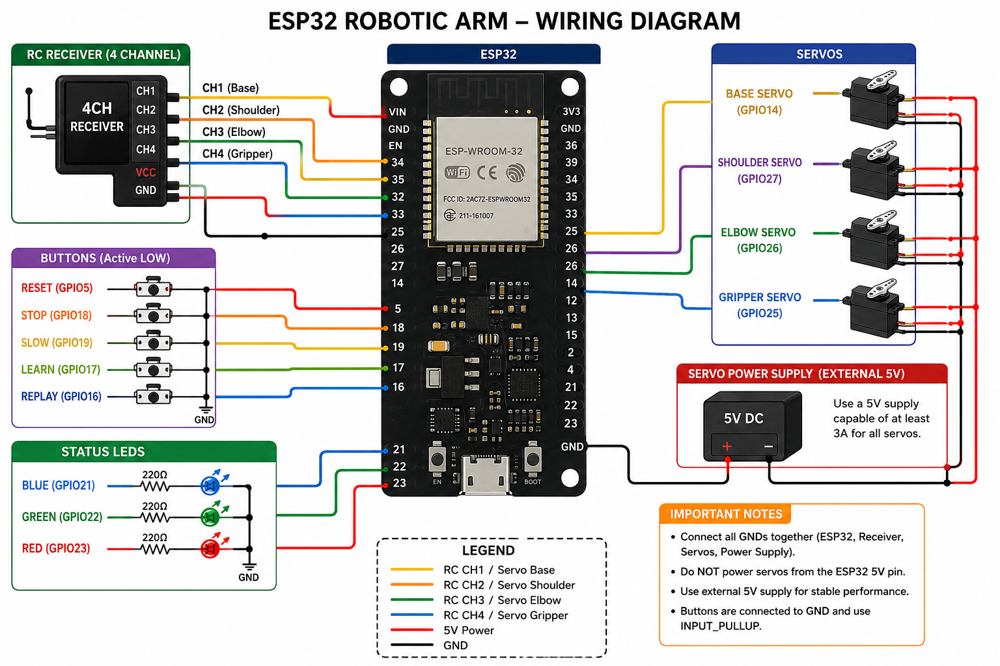

# ESP32 Robotic Arm

An ESP32-based 4-DOF robotic arm controlled wirelessly using an RC transmitter and receiver. The project demonstrates embedded control, servo motor manipulation, wireless communication, and coordinated robotic movement for pick-and-place applications.

---

## Project Overview

This project implements a four-degree-of-freedom robotic arm using an ESP32 microcontroller and a FlySky RC transmitter and receiver.

The system converts wireless control inputs into servo motor movements, allowing independent control of the arm's base, shoulder, elbow, and gripper.

The project provides practical experience with:

- Embedded systems
- Wireless control
- Servo motor control
- Microcontroller programming
- Robotic motion
- Hardware interfacing
- Pick-and-place automation

---

## Project Images

| Robotic Arm | Wiring Diagram |
|-------------|----------------|
|  |  |

---

## Features

- Wireless RC control
- Four degrees of freedom
- Independent servo motor control
- Responsive robotic arm movement
- LED-based system status indication
- Push-button controls
- Pick-and-place functionality
- Modular hardware and software design
- Expandable architecture for future development

---

## Hardware Components

| Component | Quantity |
|-----------|----------|
| ESP32 Development Board | 1 |
| Servo Motors | 4 |
| FlySky Receiver | 1 |
| Push Buttons | 5 |
| LEDs | 3 |
| Robotic Arm Chassis | 1 |
| 5V Power Supply | 1 |
| Connecting Wires | As required |
| Breadboard / PCB | Optional |

---

## Wiring

The complete wiring configuration is provided below.


---

## Repository Structure

```text
Robotic-arm/
│
├── code.ino
├── README.md
├── wiring.png
├── pic1.jpeg
├── pic2.jpeg
├── pic3.jpeg
└── 3dparts/
```

---

## Getting Started

### Prerequisites

Before setting up the project, ensure that the following are available:

- Arduino IDE
- ESP32 board support package
- ESP32Servo library
- ESP32 development board
- FlySky transmitter and receiver
- Required servo motors
- Suitable 5V power supply

### Clone the Repository

```bash
git clone https://github.com/yo5on/Robotic-arm.git
cd Robotic-arm
```

### Open the Project

Open `code.ino` in the Arduino IDE.

### Install Required Libraries

Install the following components through the Arduino IDE:

- ESP32 Board Package
- ESP32Servo Library

### Configure the ESP32

1. Connect the ESP32 to the computer.
2. Select the appropriate ESP32 board from the Arduino IDE board menu.
3. Select the correct COM port.
4. Verify the wiring connections.
5. Open `code.ino`.

### Upload the Code

Click **Upload** in the Arduino IDE and wait for the upload process to complete.

Once the code has been uploaded, power the robotic arm and transmitter/receiver system.

---

## Controls

The robotic arm is controlled through four RC channels:

| Channel | Function |
|---------|----------|
| CH1 | Base Rotation |
| CH2 | Shoulder Movement |
| CH3 | Elbow Movement |
| CH4 | Gripper Control |

Servo limits and control ranges can be adjusted in the Arduino source code according to the mechanical configuration of the arm.

---

## System Architecture

```text
RC Transmitter
      |
      v
FlySky Receiver
      |
      v
     ESP32
      |
      +---- Base Servo
      |
      +---- Shoulder Servo
      |
      +---- Elbow Servo
      |
      +---- Gripper Servo
```

---

## Working Principle

1. The RC transmitter generates control signals based on user input.
2. The FlySky receiver receives the wireless signals.
3. The ESP32 reads the corresponding receiver channels.
4. The input values are mapped to appropriate servo positions.
5. The four servo motors move the robotic arm according to the received commands.
6. LEDs provide system status information.
7. Push buttons provide additional functionality such as mode selection, reset, or calibration.

---

## Applications

This project provides a foundation for experimenting with:

- Pick-and-place systems
- Embedded robotics
- Wireless robotic control
- Servo motor coordination
- Robotic manipulation
- Industrial automation concepts
- Autonomous robotic systems

---

## Future Improvements

Potential future developments include:

- Inverse kinematics
- Preset position memory
- Mobile application control
- Wi-Fi and Bluetooth control
- Camera integration
- AI-based object detection
- Autonomous pick-and-place operations
- Motion planning and trajectory optimization
- Object tracking and classification

---

## Technologies

| Category | Technology |
|----------|------------|
| Microcontroller | ESP32 |
| Programming | C/C++ |
| Development Environment | Arduino IDE |
| Wireless Control | FlySky RC Transmitter/Receiver |
| Actuators | Servo Motors |
| Communication | RC Receiver Channels |

---

## Author

**Yo5on**

Computer Science student interested in AI/ML, robotics, embedded systems, and automation.

GitHub: https://github.com/yo5on

---

## License

This project is intended for educational and personal use. You are free to explore, modify, and extend the project for your own robotics and embedded systems experiments.

---

If you find this project useful, consider giving the repository a star.
