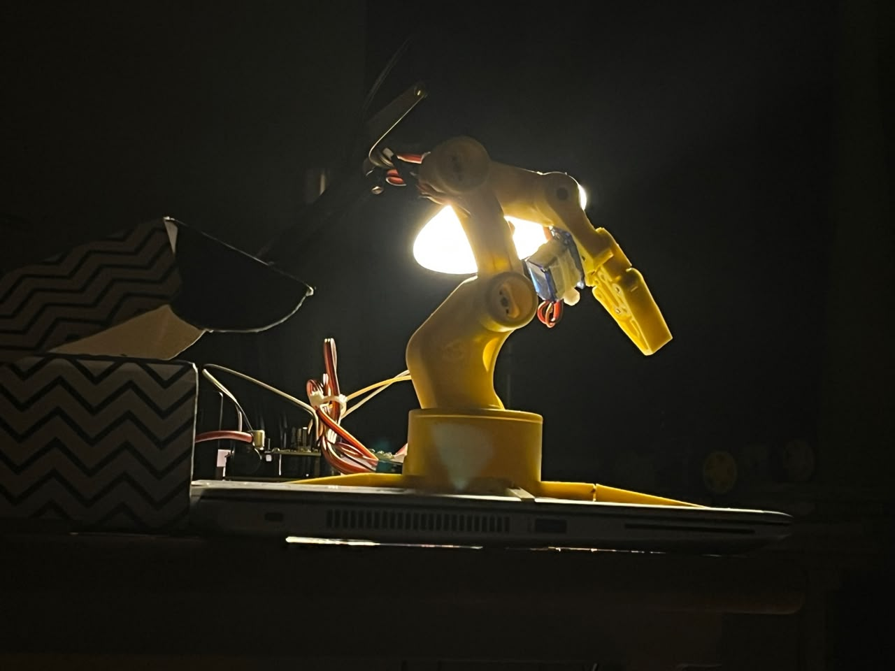
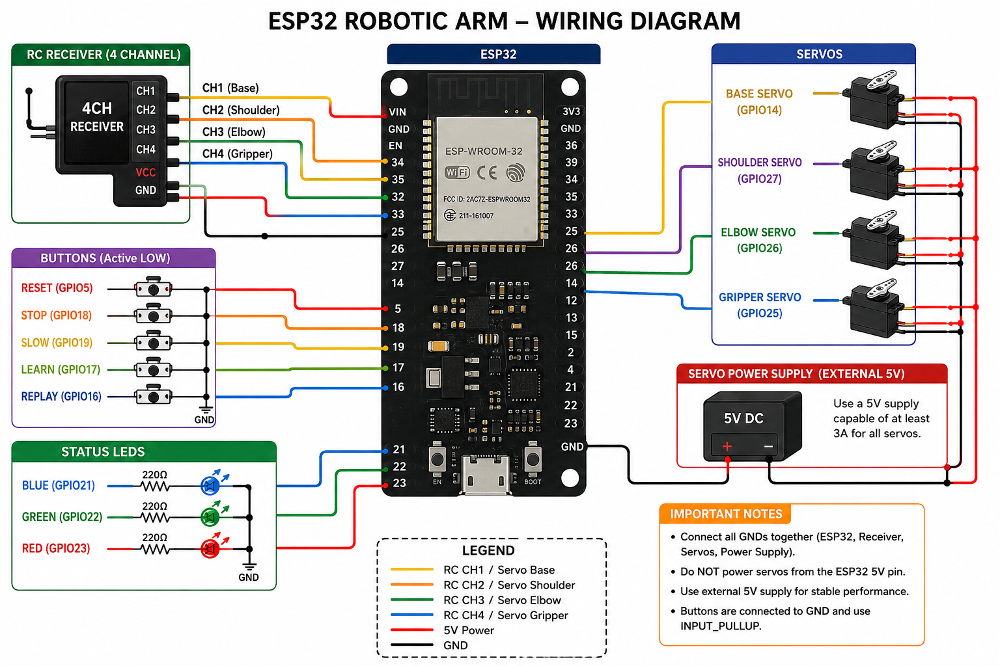

<div align="center">


<samp><b>ESP32 ROBOTIC ARM</b></samp>

<samp>robotics · esp32 · c/c++ · embedded systems</samp>

</div>

---

<div align="center"><samp>An ESP32-based 4-DOF robotic arm controlled wirelessly using an RC transmitter and receiver. The project demonstrates embedded control, servo motor manipulation, wireless communication, and coordinated robotic movement for pick-and-place applications.</samp></div>

---

<div align="center">
<samp><b>Project Overview</b></samp>
</div>

<samp>This project implements a four-degree-of-freedom robotic arm using an ESP32 microcontroller and a FlySky RC transmitter and receiver.</samp>

<samp>The system converts wireless control inputs into servo motor movements, allowing independent control of the arm's base, shoulder, elbow, and gripper.</samp>

<samp>The project provides practical experience with:</samp>

- <samp>Embedded systems</samp>
- <samp>Wireless control</samp>
- <samp>Servo motor control</samp>
- <samp>Microcontroller programming</samp>
- <samp>Robotic motion</samp>
- <samp>Hardware interfacing</samp>
- <samp>Pick-and-place automation</samp>

---

<div align="center">
<samp><b>Project Images</b></samp>
</div>

<table align="center">
<tr><th><samp>Robotic Arm</samp></th><th><samp>Wiring Diagram</samp></th></tr>
<tr><td></td><td></td></tr>
</table>

---

<div align="center">
<samp><b>Features</b></samp>
</div>

- <samp>Wireless RC control</samp>
- <samp>Four degrees of freedom</samp>
- <samp>Independent servo motor control</samp>
- <samp>Responsive robotic arm movement</samp>
- <samp>LED-based system status indication</samp>
- <samp>Push-button controls</samp>
- <samp>Pick-and-place functionality</samp>
- <samp>Modular hardware and software design</samp>
- <samp>Expandable architecture for future development</samp>

---

<div align="center">
<samp><b>Hardware Components</b></samp>
</div>

<table align="center">
<tr><th><samp>Component</samp></th><th><samp>Quantity</samp></th></tr>
<tr><td><samp>ESP32 Development Board</samp></td><td><samp>1</samp></td></tr>
<tr><td><samp>Servo Motors</samp></td><td><samp>4</samp></td></tr>
<tr><td><samp>FlySky Receiver</samp></td><td><samp>1</samp></td></tr>
<tr><td><samp>Push Buttons</samp></td><td><samp>5</samp></td></tr>
<tr><td><samp>LEDs</samp></td><td><samp>3</samp></td></tr>
<tr><td><samp>Robotic Arm Chassis</samp></td><td><samp>1</samp></td></tr>
<tr><td><samp>5V Power Supply</samp></td><td><samp>1</samp></td></tr>
<tr><td><samp>Connecting Wires</samp></td><td><samp>As required</samp></td></tr>
<tr><td><samp>Breadboard / PCB</samp></td><td><samp>Optional</samp></td></tr>
</table>

---

<div align="center">
<samp><b>Wiring</b></samp>
</div>

<samp>The complete wiring configuration is provided below.</samp>

<div align="center"></div>

---

<div align="center">
<samp><b>Repository Structure</b></samp>
</div>

```text
Robotic-arm/
│
├── code.ino
├── README.md
├── wiring.png
├── pic1.jpeg
├── pic2.jpeg
├── pic3.jpeg
└── 3dparts/
```

---

<div align="center">
<samp><b>Getting Started</b></samp>
</div>

<samp><b>Prerequisites</b></samp>

<samp>Before setting up the project, ensure that the following are available:</samp>

- <samp>Arduino IDE</samp>
- <samp>ESP32 board support package</samp>
- <samp>ESP32Servo library</samp>
- <samp>ESP32 development board</samp>
- <samp>FlySky transmitter and receiver</samp>
- <samp>Required servo motors</samp>
- <samp>Suitable 5V power supply</samp>

<samp><b>Clone the Repository</b></samp>

```bash
git clone https://github.com/yo5on/Robotic-arm.git
cd Robotic-arm
```

<samp><b>Open the Project</b></samp>

<samp>Open <code>code.ino</code> in the Arduino IDE.</samp>

<samp><b>Install Required Libraries</b></samp>

<samp>Install the following components through the Arduino IDE:</samp>

- <samp>ESP32 Board Package</samp>
- <samp>ESP32Servo Library</samp>

<samp><b>Configure the ESP32</b></samp>

<samp>1. Connect the ESP32 to the computer.</samp>

<samp>2. Select the appropriate ESP32 board from the Arduino IDE board menu.</samp>

<samp>3. Select the correct COM port.</samp>

<samp>4. Verify the wiring connections.</samp>

<samp>5. Open <code>code.ino</code>.</samp>

<samp><b>Upload the Code</b></samp>

<samp>Click <strong>Upload</strong> in the Arduino IDE and wait for the upload process to complete.</samp>

<samp>Once the code has been uploaded, power the robotic arm and transmitter/receiver system.</samp>

---

<div align="center">
<samp><b>Controls</b></samp>
</div>

<samp>The robotic arm is controlled through four RC channels:</samp>

<table align="center">
<tr><th><samp>Channel</samp></th><th><samp>Function</samp></th></tr>
<tr><td><samp>CH1</samp></td><td><samp>Base Rotation</samp></td></tr>
<tr><td><samp>CH2</samp></td><td><samp>Shoulder Movement</samp></td></tr>
<tr><td><samp>CH3</samp></td><td><samp>Elbow Movement</samp></td></tr>
<tr><td><samp>CH4</samp></td><td><samp>Gripper Control</samp></td></tr>
</table>

<samp>Servo limits and control ranges can be adjusted in the Arduino source code according to the mechanical configuration of the arm.</samp>

---

<div align="center">
<samp><b>System Architecture</b></samp>
</div>

```text
RC Transmitter
      |
      v
FlySky Receiver
      |
      v
     ESP32
      |
      +---- Base Servo
      |
      +---- Shoulder Servo
      |
      +---- Elbow Servo
      |
      +---- Gripper Servo
```

---

<div align="center">
<samp><b>Working Principle</b></samp>
</div>

<samp>1. The RC transmitter generates control signals based on user input.</samp>

<samp>2. The FlySky receiver receives the wireless signals.</samp>

<samp>3. The ESP32 reads the corresponding receiver channels.</samp>

<samp>4. The input values are mapped to appropriate servo positions.</samp>

<samp>5. The four servo motors move the robotic arm according to the received commands.</samp>

<samp>6. LEDs provide system status information.</samp>

<samp>7. Push buttons provide additional functionality such as mode selection, reset, or calibration.</samp>

---

<div align="center">
<samp><b>Applications</b></samp>
</div>

- <samp>Pick-and-place systems</samp>
- <samp>Embedded robotics</samp>
- <samp>Wireless robotic control</samp>
- <samp>Servo motor coordination</samp>
- <samp>Robotic manipulation</samp>
- <samp>Industrial automation concepts</samp>
- <samp>Autonomous robotic systems</samp>

---

<div align="center">
<samp><b>Future Improvements</b></samp>
</div>

- <samp>Inverse kinematics</samp>
- <samp>Preset position memory</samp>
- <samp>Mobile application control</samp>
- <samp>Wi-Fi and Bluetooth control</samp>
- <samp>Camera integration</samp>
- <samp>AI-based object detection</samp>
- <samp>Autonomous pick-and-place operations</samp>
- <samp>Motion planning and trajectory optimization</samp>
- <samp>Object tracking and classification</samp>

---

<div align="center">
<samp><b>Technologies</b></samp>
</div>

<table align="center">
<tr><th><samp>Category</samp></th><th><samp>Technology</samp></th></tr>
<tr><td><samp>Microcontroller</samp></td><td><samp>ESP32</samp></td></tr>
<tr><td><samp>Programming</samp></td><td><samp>C/C++</samp></td></tr>
<tr><td><samp>Development Environment</samp></td><td><samp>Arduino IDE</samp></td></tr>
<tr><td><samp>Wireless Control</samp></td><td><samp>FlySky RC Transmitter/Receiver</samp></td></tr>
<tr><td><samp>Actuators</samp></td><td><samp>Servo Motors</samp></td></tr>
<tr><td><samp>Communication</samp></td><td><samp>RC Receiver Channels</samp></td></tr>
</table>

---

<div align="center">
<samp><b>Author</b></samp>
</div>

<div align="center">
<samp><strong>Yoson</strong></samp>

<samp>Computer Science student interested in AI/ML, robotics, embedded systems, and automation.</samp>

<samp>GitHub: https://github.com/yo5on</samp>
</div>

---

<div align="center">
<samp><b>License</b></samp>
</div>

<samp>This project is intended for educational and personal use. You are free to explore, modify, and extend the project for your own robotics and embedded systems experiments.</samp>

<div align="center">
<samp>If you find this project useful, consider giving the repository a star.</samp>
</div>
